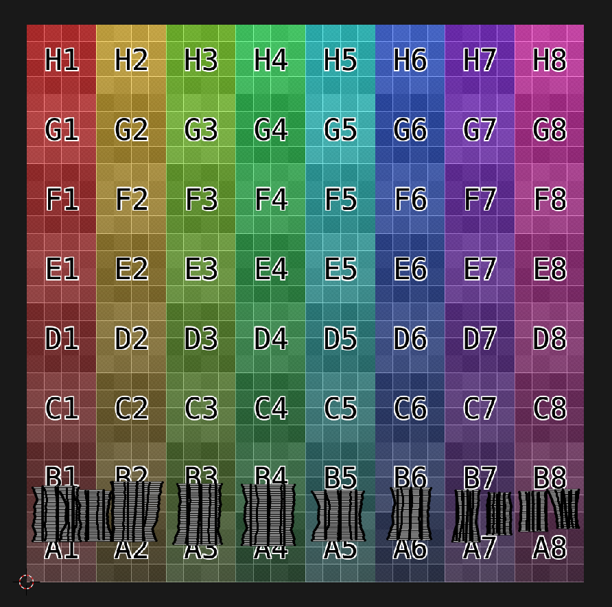

# orels1's AudioLink Shader

> This is a fairly simplistic shader that is meant for quick addition of audio-link based effects to your VRChat Avatar

[twitter](https://twitter.com/orels1_)  
[discord](https://discord.gg/fR869XP)

Thx to [ACIIL's shader base for grabbing audio data](https://github.com/ACIIL/udon-audio-link-avatar-demo/blob/main/shader/grabpassAudioAvatarDemo.shader)

Thx to [llealloo](https://github.com/llealloo/vrc-udon-audio-link) for making the AudioLink system

Much love ❤

## [DOWNLOAD HERE](https://github.com/orels1/orels1-AudioLink-Shader/archive/refs/heads/master.zip)

## Features

- AudioData band selection and width control
- UV / Global modes for using different parts of the texture for your effects vs one band for all
- Hue / Saturation based effects
- Fallback system (if you still want BPM-based effects for non-audio link worlds)

## Demo Video

[Check out the Demo!](https://video.bunnycdn.com/play/165/8af51a52-e4ec-44c6-9764-d59e57f47e9a)

## Usage

- Duplicate the included Auio Link Hologram material
- Apply to your mesh
- Tweak settings to your linking

> For more interesting - it is recommended to put the UVs of the affected mesh into horizontal groups, where each quarter of UVs represents one band.

Here's how UV's which will grab all the bass pulses will look like:

The shader allows you to adjust the selected band in runtime (e.g., with an AV 3.0 slider)

## Properties

Here's a full list of shader properties and their explanation

**Audio Lookup**

- Band Lookup Mode, selects between using one band for the whole mesh, vs using the original uv's
- Band Selection, in UV mode - offsets the UV's by 0.25 for each band, in Global mode, shifts the whole mesh between bands
- Width, adjusts how much of the texture to sample: 1 - full texture from left to right, -1 - full texture in reverse, 0 - fully squished (the mesh will pulse instead of showing a gradient)

**Colors**

- Emission, Main Color / emission strength
- Rim Darken Color, the color of the rim effect
- Rim Effect Strength, the visibility of the rim effect
- Global Strength, the overall multiplier of the effect, set to 0 to fully disable

**Customization**

- Hue Speed, the speed of the hue shift effect
- Hue Shift, the amount of static hue shift to apply, only useful with Hue Speed set to 0
- Hue Audio Strength, the amount of hue shifting to apply based on the audio data. The peak of the audio will offset more than the rest, allowing for cool gradient effects
- Saturation, the global saturation slider
- Saturation Audio Strength, similar to Hue Audio Strength, allows to offset the saturation based on the audio data, allowing for cool gradients to appear

**Fallback**

> If you ever end up in a world with no audio link - you can enable the fallback mode, which will use a provided texture instead of the in-world audio data

- Enable Fallback Mode, enables the fallback system
- Audio Link Fallback Texture, a sample texture that is similar to an audio link, with each band going 2x faster than the previous one
- BPM, the speed of the texture scrolling in beats per minute
- Note, the note division, you can make it, so the texture does a full scroll every 2 notes, 4 notes, etc..

If you have any questions - feel free to ask them on [twitter (@orels1_)](https://twitter.com/orels1_) or [in my discord](https://discord.gg/fR869XP)
